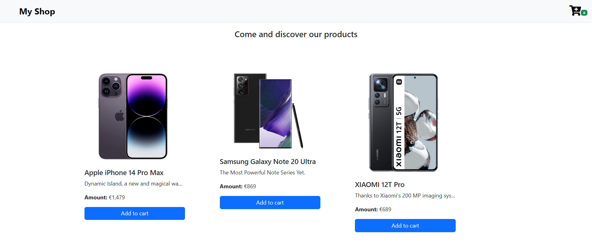
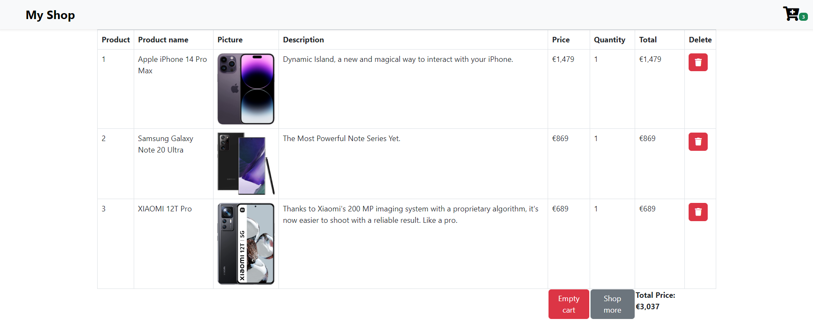
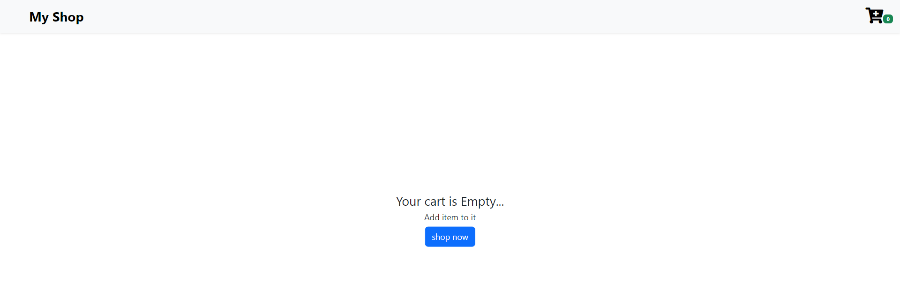

## TP-Angular

### Commandes step by step :

Installer node_modules :
```bash
  npm install 
```
Dans le même terminal, lancer l'application angular :
```bash
  ng serve
```

Ouvrir un second terminal, effectuer la commande suivante pour lancer le serveur de données :
```bash
  json-server --watch db.json
```

Si l'installation des dépendances pour json-server est requise, effectuer la commande ci-dessous. Une fois cela fait, relancer la commande précédente.
```bash
  npm install json-server
```

### Apercu de l'application :



